# Table of Contents {#table-of-contents .TOC-Heading}

[Introduction 2](#introduction)

[What is TFC NXP: 2](#what-is-tfc-nxp)

[Rules: 2](#rules)

[Laps 3](#laps)

[Making Tracks: 3](#making-tracks)

[Difficulties and proposed solutions:
3](#difficulties-and-proposed-solutions)

[Car 3](#car)

[Parts explanation: 3](#parts-explanation)

[Careful: 3](#careful)

[Mechanical modifications: 4](#mechanical-modifications)

[Electrical Modifications: 5](#electrical-modifications)

[2^nd^ camera: 5](#nd-camera)

[Fried camera problem 6](#section-1)

[PWM Problem 7](#pwm-problem)

[Communication 7](#communication)

[USB: 8](#usb)

[Bluetooth: 8](#bluetooth)

[Sensors 9](#sensors)

[Camera(s): 9](#cameras)

[Encoder:
9](#cusersingbaappdatalocalmicrosoftwindowsinetcachecontent.wordcamprob.pngencoder)

[Ultrasonic: 10](#ultrasonic)

[Software 10](#software)

[Used softwares and libraries: 10](#used-softwares-and-libraries)

[Libraries modifications: 11](#libraries-modifications)

[Automatics 12](#automatics)

[Steering Servo-Motor: 12](#steering-servo-motor)

[Problems and solutions:
13](#cusersingbaappdatalocalmicrosoftwindowsinetcachecontent.worduntitled-diagram.png)

[Rear wheels PIDs: 14](#rear-wheels-pids)

[Problems and proposed solutions: 14](#problems-and-proposed-solutions)

# Introduction

## What is TFC NXP:

The NXP Cup is a global competition where student teams and robotics
clubs build, program, and race a model car around a track for speed. The
overall aim of the NXP CUP is to make and race pro-level autonomous cars
on low cost. Optimize the hardware and software to complete the track in
the fastest time. The creation of this autonomous car requires:

-   Embedded software programming and basic circuit creation using NXP
    parts included in the entry kit

-   Students to create motor control hardware and software to propel and
    steer their intelligent car

-   Students must also interface to a camera to navigate the car through
    the race course by following the guide line.

Start programming during your winter semester and win great prices! This
competition lends itself well to use in senior design/capstone project
courses. The contest time frame can fit within the average 3 to 4 months
semester. Most development work can be done easily within that timeline.

## Rules:

Rules change from year to year but the basic race is the **Timed Race:**

-   **Intersections** ✔

-   **3 wheels allowed out of tracks**

-   **3 attempts ([first]{.ul} attempt completed is recorded, remaining
    attempts are lost)**

-   **The racecar fails to leave the starting area within 30 seconds
    after beginning of the race \[+1 second\].**

-   **The race car fails to stop within 2 meters/6 feet of the finish
    line or leaves the track**

**after crossing the finish line \[+1 second\]**

-   **The racecar exits the racetrack after crossing the finish line
    \[+1 second\]**

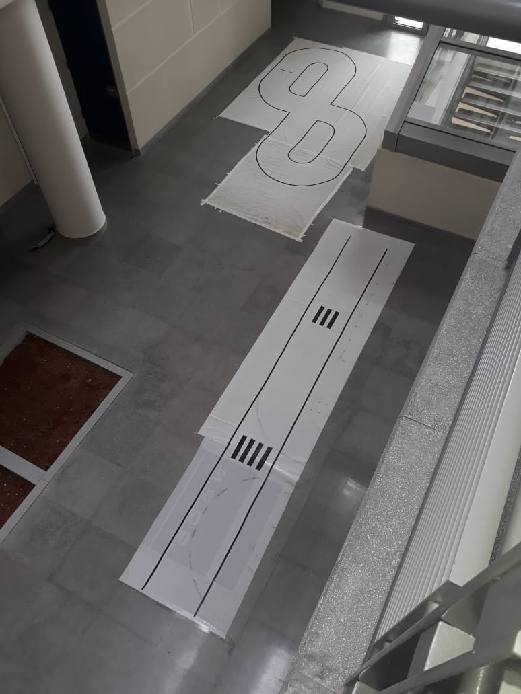{width="3.103844050743657in"
height="4.136578083989502in"}Extra races ( disciplines ) change from
year to year.

Detailed explanation for the rules in 2018-2019:
<http://ul.edu.lb/files/announcements/151120183.pdf>

The file is named"NXP Cup 2018_19_rules_2018_19 .pdf"

# Laps

## Making Tracks:

We Used 2^nd^ hand Flex Paper (the material used for posters and
advertisements).

To create Track's sides, we Used electrical tape.

### Difficulties and proposed solutions:

The electrical tape is shiny: sometimes the camera couldn't distinguish
white for shiny black lines.

We propose finding mat tape, or surrounding the lap with curtains, or
printing the lap parts on papers and glue it on card board.

You can find the track's configuration in "NXP
CUP_track_configurations_2018_19.pdf" or
<https://community.nxp.com/servlet/JiveServlet/download/101612-7-431006/NXP+CUP_track_configurations_2018_19.pdf>

# Car

## Parts explanation:

-   The Camera is a 128 pixels line CCD sensor, the potentiometer
    encircled in red can be used to adjust the gain, to be used in case
    of saturation

-   the lense can modify the focus

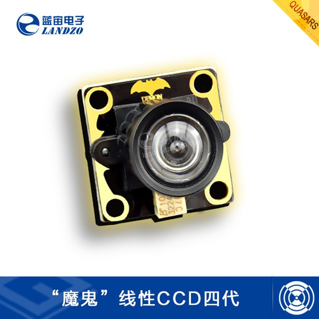{width="1.4531649168853893in"
height="1.4299234470691164in"}

### Careful: 

!! Always unplug the battery before mounting any board over the other,
or mounting the camera

!! the Power switch doesn't completely cut the voltage, so any
misplacement could cause short circuits!!

!! the camera is very sensitive remove the battery when plugging it

!! the camera flat cable is fragile, handle it carefully, it is hard to
find spare flat cables!!

!! the servo motor demands peak current, the system board has current
limiting circuit: so sometimes the system board cuts the power from the
servo!!! try using a big capacitor less than 2000 uF, or use another
type of Servo.

!! Bluetooth 3.3V and NC pins on the system board are labeled
[wrong]{.ul} swap them.

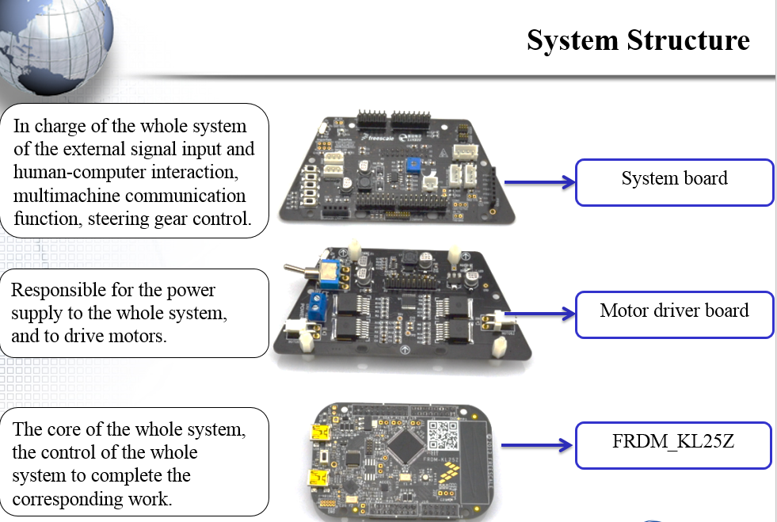{width="6.499791119860017in"
height="3.499838145231846in"}

## Mechanical modifications:

-   Front Servo Motor Protection to absorb shocks from sudden impacts

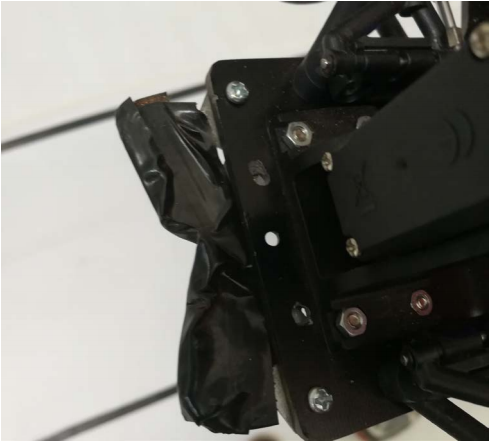{width="2.8722222222222222in"
height="2.5930555555555554in"}

-   Front wheels weren't parallel, so we adjusted them by tightening the
    axes

## 

## Electrical Modifications:

### 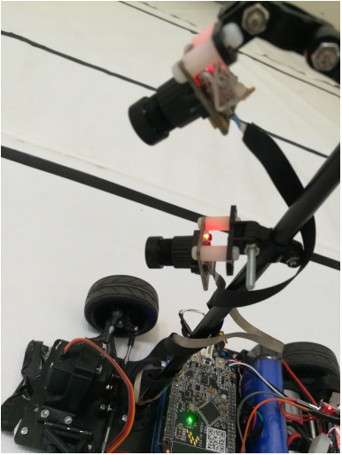2^nd^ camera:

On the intersection, we have a gap in the information input from the
near camera (because the camera is only seeing white color). To
compensate this, we used a 2^nd^ camera mounted below, and pointed to
see further (40 cm), and the one above (20 cm)

2 camera connecters couldn't fit simultaneously, so we made a cable for
cam1.

TBD

.....

### 

### Fried camera problem

{width="1.7558136482939632in"
height="2.167050524934383in"}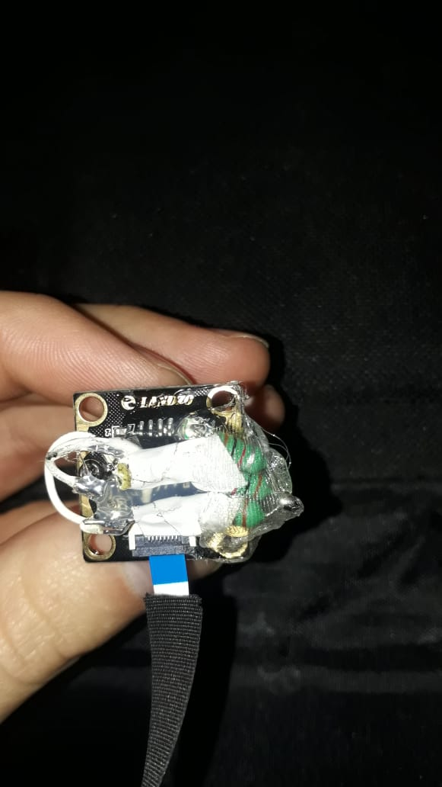

The camera was fried from first use, and we couldn't find a spare camera
- so trying to fix it - we located the fried component: a 1500 uH

we used 3 inductors: 2 parallel in series with another of values 1000 uH
because of unavailability...

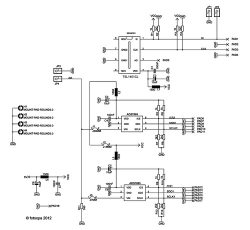{width="4.0in"
height="2.5in"}

*Camera LS1401 Schematic*

### PWM Problem

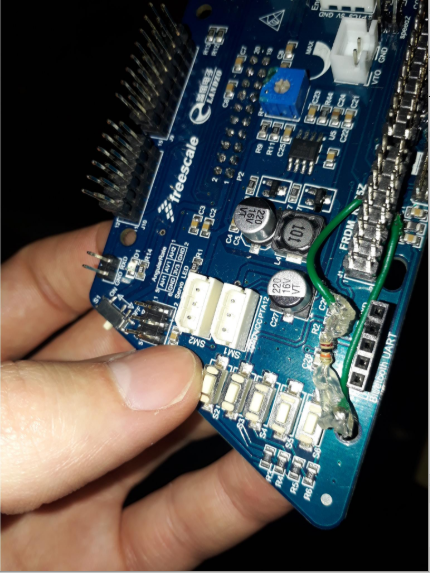We had a problem where the motor was spinning
nonstop, the PWM signal PTA4 was deformed it seemed that the pull up
resistor in the board (PTA4) was fried or something, we used a pull down
resistor of 10k on the pin PTA4 to fix the problem, **but** the board
seems to not turn on if any pin is pulled down. So to fix this we
connected the A4 to C6, at the start of the program, C6 is high =\> the
board turns on; then after 0.2 seconds C6 is set to low and it works
brilliantly

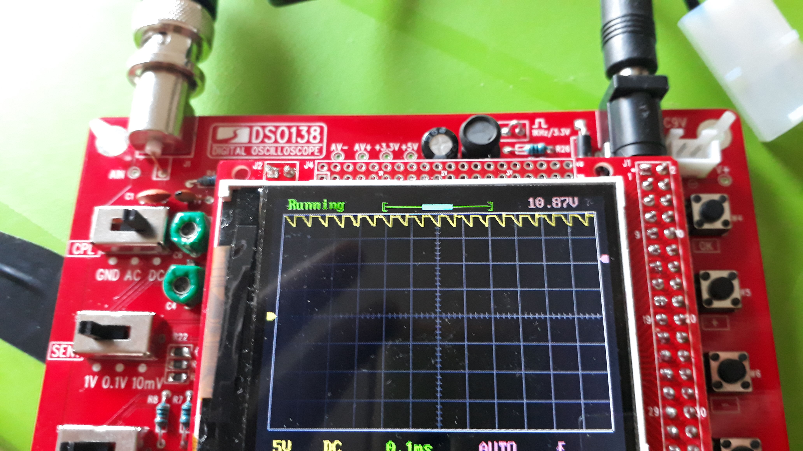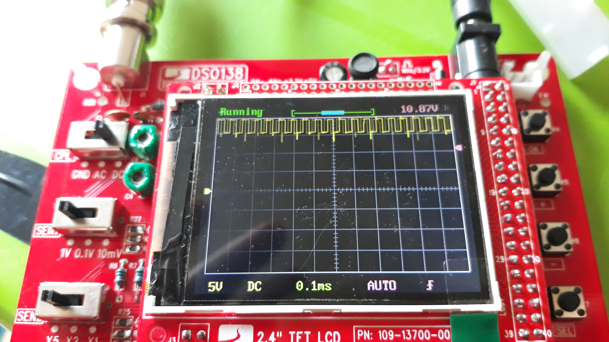

*Before and after image of PTA4 PWM signal*

### 

# Communication

Download Tera Term or in Arduino IDE open tools-\>Serial Monitor to do
serial communication with the board.

Be careful of choosing the same **Baudrate** in the C++/C program and
the Terminal.

## USB:

KL25z provides 2 usb ports use the one with open SDA feature to upload
the code. 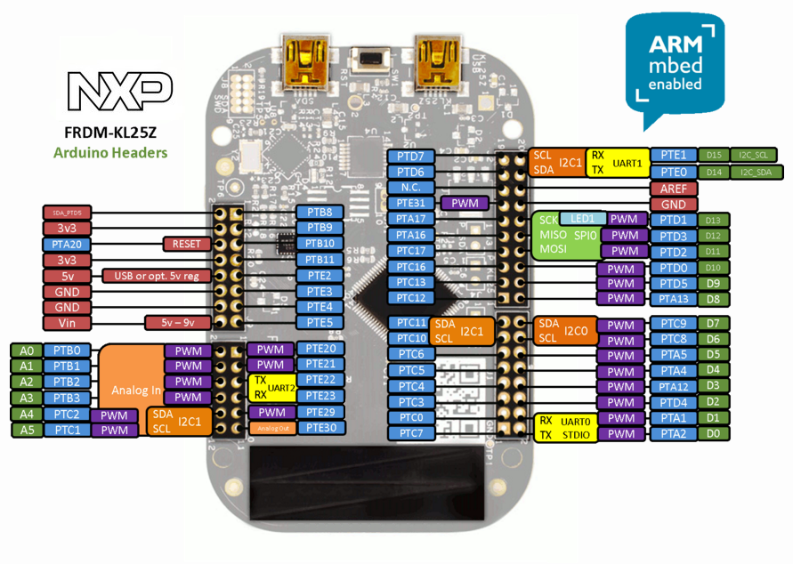

### Pins conflict

You can use any extra pins not connected: Motor Control board NXP Cup
EMEAS Alamak model.pdf

Some pins are used as UART or I2C by the open-SDA USB port; the USB
should be disconnected when using them.

## Bluetooth:

Using an Arduino, set the max Baudrate for the module 115200, connect
the key/state pin to 3.3V to enter AT mode.

Then follow this link
<https://www.instructables.com/id/Changing-Baud-Rate-of-HC-05-Bluetooth/>

We used HC05 Bluetooth module, but the system board provides different
pins configuration and 3.3V, don't use it, use 5V from any other pin
instead...

# Sensors

## Camera(s): 

The automatic system requires entry of the middle point of the track:

Calculate middle point by applying differential on the line table (TFC\_
LineScanImage0), if value \> threshold =\> this is a transition
white/black.

While crossing an intersection there is a gap of 55 cm, where we don't
have input from the camera; to compensate for it, we use a 2^nd^ far
camera \@50cm; and the main \@20cm.

If no input is provided by the main cam, the 2^nd^ is considered as a
backup.

Unfortunately, our library didn't provide a function to change exposure
time, to adapt to different illumination conditions, nevertheless it
wasn't a big problem, tune the cam-gain accordingly.

## 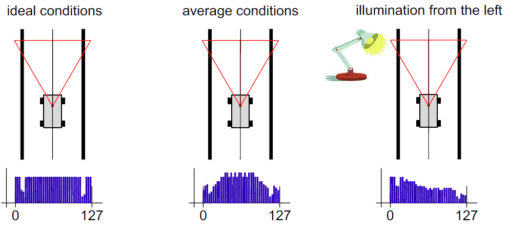{width="6.490277777777778in" height="3.01875in"}Encoder:

We couldn't find a wheel encoder that fits in between the wheels, so we
made one by painting the wheels gear with "typex", so it reflects the
infrared better, and put sticky tapes on the outside to eliminate
unwanted infrared light...

The encoder signal must be connected to interrupt supporting pins so we
used PTD2 and PTD3,

{width="6.5in" height="4.859911417322834in"}

## Ultrasonic:

For the obstacle avoidance lap, we thought of using the cheap ultrasonic
sensor: HC-SR04, nevertheless it doesn't work properly when the car is
moving, we don't recommend it...

# Software

## Used softwares and libraries:

In <https://nxp.gitbook.io/nxp-cup-hardware-reference-alamak/software>
NXP recommends multiple IDEs, We used mbed environment because it was
the simplest, and coding is done in the browser.

This page <https://os.mbed.com/platforms/KL25Z/> provides steps to
upload binary code to KL25z.

Basically, you need to download the mbed bootloader to the board and
then you can drag and drop compiled/downloaded C/C++ from the mbed
compiler **MBED.**

### Problem

If the uploaded code doesn't work it might be because of the system
storage service, which writes files on any USB plugged into the
computer.

You have to disable **storage service** in services.vsc

## Libraries modifications:

We used
<https://os.mbed.com/users/alejandroRL/code/TFC-TEST_UPDATED_HW/> as the
basis of our library...

The CCD1 camera is configured by default, but CCD2 is not.

So we wrote the configuration:

+------------------------------------------------+
| \#define TAOS_CLK_HIGH1 PTB-\>PSOR = (1\<\<11) |
|                                                |
| \#define TAOS_CLK_LOW1 PTB-\>PCOR = (1\<\<11)  |
|                                                |
| \#define TAOS_SI_HIGH1 PTB-\>PSOR = (1\<\<10)  |
|                                                |
| \#define TAOS_SI_LOW1 PTB-\>PCOR = (1\<\<10)   |
+------------------------------------------------+

Each PIN according to its port (B or C) and its number.

And move the clock for both cameras at the same time...

The default library is using a ping-pong addressing of the tables for
the camera values:

+----------------------------------------------------------------+
| if(LineScanWorkingBuffer == 0) {                               |
|                                                                |
| LineScanWorkingBuffer = 1;                                     |
|                                                                |
| LineScanImage0WorkingBuffer = &LineScanImage0Buffer\[1\]\[0\]; |
|                                                                |
| LineScanImage1WorkingBuffer = &LineScanImage1Buffer\[1\]\[0\]; |
|                                                                |
| TFC_LineScanImage0 = &LineScanImage0Buffer\[0\]\[0\];          |
|                                                                |
| TFC_LineScanImage1 = &LineScanImage1Buffer\[0\]\[0\];          |
|                                                                |
| } else {                                                       |
|                                                                |
| LineScanWorkingBuffer = 0;                                     |
|                                                                |
| LineScanImage0WorkingBuffer = &LineScanImage0Buffer\[0\]\[0\]; |
|                                                                |
| LineScanImage1WorkingBuffer = &LineScanImage1Buffer\[0\]\[0\]; |
|                                                                |
| TFC_LineScanImage0 = &LineScanImage0Buffer\[1\]\[0\];          |
|                                                                |
| TFC_LineScanImage1 = &LineScanImage1Buffer\[1\]\[0\];          |
|                                                                |
| }                                                              |
+----------------------------------------------------------------+

So TFC_LineScanImage0 points to &LineScanImage0Buffer\[0\]\[0\] and
&LineScanImage0Buffer\[1\]\[0\] alternatively.

Even though you can use TFC_LineScanImage0 it is recommended to yet
another table, because it is declared volatile.

# Automatics

## Steering Servo-Motor: 

{width="6.490277777777778in"
height="2.7263888888888888in"}

Get input from the road middle relative to the car, our goal is to stay
in the center of the track

=\> ( 0+128)/2 = 64;

If road middle \> 64 =\> the car is to the left of the road =\> go right

And vice versa...

This can be achieved in the normal case by a simple PID:

RoadMiddle =( LeftLineIndex + RightLineIndex)/2;

Error = 64 - RoadMiddle ;

servo_position = KP\*Error + KD\*derivation + KI \* integration;

### 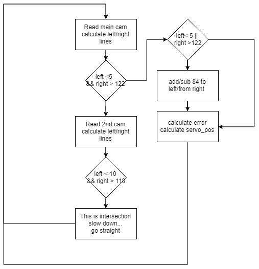{width="5.283333333333333in" height="5.48125in"}

### Problems and solutions:

be careful: left and right lines are separated by 84 pixels in our case,
hence if one is only shown: add or subtract 84 from the other...!!

While cornering, if the car doesn't follow the middle road, it is
susceptible to get wrong data ( right and left line gets confused... )

Save the error and check difference of {Error_old -- Error} and decide
accordingly

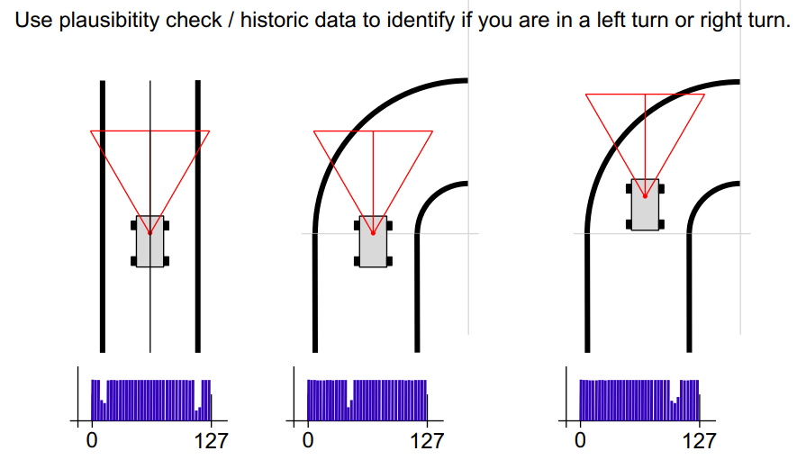

## Rear wheels PIDs:

The speed encoder is important to stabilize the max speed at straight
roads, so it need a PID.

The encoder's output is fed to a PID similar to the ones shown before.
The signal is too noisy and needs filtering, a mean filter will do the
job and spikes of huge values are discarded:

+----------------------------------------------------------------------+
| void Encoder::push(float newspeed){                                  |
|                                                                      |
| for(int i = LENGTHSPEED-1; i\>0;i\--)                                |
|                                                                      |
| speeds\[i\] = speeds\[i-1\];                                         |
|                                                                      |
| if(newspeed - speeds\[0\] \< MAXDIFFERENCE \|\| speeds\[0\]          |
| -newspeed \> MAXDIFFERENCE) /// not pushing noisy values             |
|                                                                      |
| speeds\[0\] = newspeed;                                              |
|                                                                      |
| }                                                                    |
+----------------------------------------------------------------------+

### Problems and proposed solutions:

The usage of a PID on the motors provided good results on straight
tracks, but while cornering, it is important to correctly guide the
power to the different wheels...

We tried modeling the system using a simple graph with 16 points (spline
cubique), it didn't work out well enough.
